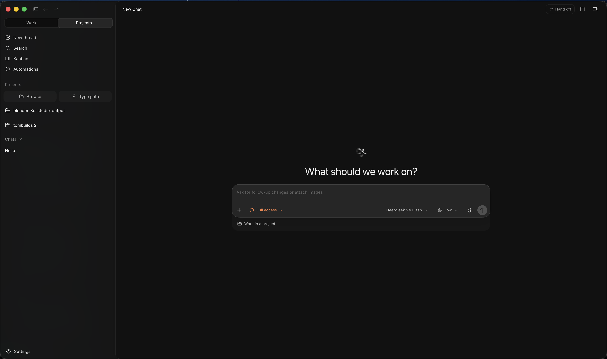

# DJL

[](https://github.com/Anthonysu798/DJL/actions/workflows/desktop-ci.yml)
[](https://github.com/Anthonysu798/DJL/releases/latest)
[](LICENSE)

DJL is a local-first desktop workspace for coding agents. It brings chats, terminals, browser
previews, diffs, Git operations, provider sessions, and task handoffs into one focused application.



## Download

Download installers from [GitHub Releases](https://github.com/Anthonysu798/DJL/releases/latest).

| Platform | Architecture | Release asset |
| --- | --- | --- |
| macOS | Apple Silicon | `DJL-X.Y.Z-arm64.dmg` |
| macOS | Intel | `DJL-X.Y.Z-x64.dmg` |
| Windows | x64 | `DJL-X.Y.Z-x64.exe` |

> [!NOTE]
> Windows releases are Authenticode signed and RFC 3161 timestamped by Anthony Su through Microsoft
> Artifact Signing. If Windows displays a reputation warning, confirm that the publisher is
> **Anthony Su** and verify the installer against `SHA256SUMS`. macOS releases are Developer ID
> signed, notarized, and stapled.

## Highlights

- Use existing Codex, Claude Code, Gemini, OpenCode, Cursor, Grok, Kilo Code, and Pi accounts.
- Run parallel tasks across projects and isolated Git worktrees.
- Keep conversations, terminals, browser previews, diffs, and agent activity together.
- Review changes and complete branch, commit, push, and pull-request workflows.
- Pair the optional DJL iPhone app with the desktop through an end-to-end encrypted remote channel.

## Architecture

The desktop product is assembled from a focused part of this monorepo:

| Layer | Location | Responsibility |
| --- | --- | --- |
| Electron shell | `apps/desktop` | Native lifecycle, preload boundary, updates, and packaging |
| Renderer | `apps/web` | React interface and browser tests |
| Bundled backend | `apps/server` | Provider sessions, local APIs, and the packaged CLI runtime |
| Desktop gateway | `apps/remote-gateway` | Local encrypted remote-control endpoint |
| Contracts and runtime libraries | `packages/contracts`, `packages/shared`, `packages/remote-protocol`, `packages/effect-acp` | Shared schemas and desktop runtime behavior |
| Embedded OpenCode runtime | `vendor/opencode` | Pinned packaged dependency; DJL verifies the embedded binary without running upstream OpenCode CI |

The repository also retains iOS, relay, landing, and marketing sources. They are not built, tested,
deployed, or released by the desktop workflows. See the
[desktop release architecture](docs/release.md) for the exact CI/CD boundary.

## Local development

Install [Bun](https://bun.sh/) and Node.js versions compatible with `package.json`, then install and
authorize at least one supported provider CLI.

```sh
bun install --frozen-lockfile
bun run dev:desktop
```

Useful desktop checks:

```sh
bun run ci:desktop:typecheck
bun run ci:desktop:test
bun run build:desktop
bun run test:desktop-smoke
```

Release engineering is documented in [docs/release.md](docs/release.md). Preparing the history-free
public repository is documented in [docs/open-source-launch.md](docs/open-source-launch.md).

## Privacy and security

Projects, task history, and credentials stay on your computer unless a selected provider needs
prompt or tool context to perform a task. The optional remote relay forwards encrypted frames and
routing metadata, not plaintext task content. Read the
[remote architecture](docs/remote/architecture.md), [threat model](docs/security/threat-model.md),
and [security policy](SECURITY.md).

Do not report vulnerabilities in a public issue. Use
[GitHub private vulnerability reporting](https://github.com/Anthonysu798/DJL/security/advisories/new).

## Contributing and attribution

Focused fixes are welcome; read [CONTRIBUTING.md](CONTRIBUTING.md) first. DJL is MIT licensed and
retains the original Synara attribution alongside Anthony Su's copyright notice. Remodex,
OpenCode, Ghostty, and other bundled dependencies retain their own notices and license terms in
[THIRD_PARTY_NOTICES.md](THIRD_PARTY_NOTICES.md).
