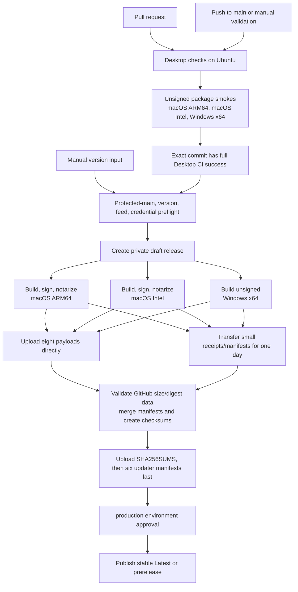

# DJL desktop CI/CD and release runbook

This document is the source of truth for testing and releasing the DJL desktop product from
`Anthonysu798/DJL`. Source, tags, installers, updater manifests, checksums, and releases live in
that one repository.

The workflows do not test or release iOS, the remote relay, landing site, marketing site, Linux
installers, npm packages, or standalone OpenCode. OpenCode is verified only as the pinned runtime
embedded in DJL.

## Release invariants

- Production releases are manually dispatched from the current protected `main` commit.
- The only workflow input is `version`, using `X.Y.Z` or `X.Y.Z-prerelease`.
- Both macOS builds are Developer ID signed, notarized, stapled, and verified.
- Windows x64 is intentionally unsigned; `Get-AuthenticodeSignature` must return `NotSigned`.
- A private draft exists before native builds start.
- Native runners upload large payloads directly to that draft.
- Only receipts and source manifests use one-day Actions artifacts.
- Updater manifests upload last. A failed job leaves a private draft, never a partial public feed.
- The protected `production` environment is the only job allowed to publish the draft.
- A release contains exactly 15 assets and no Linux payloads.

## Workflow architecture



## Desktop CI

`.github/workflows/desktop-ci.yml` runs `Desktop checks` on every pull request:

1. frozen Bun installation with lifecycle scripts allowed only for trusted `node-pty`;
2. scoped format and lint checks;
3. typechecking for the Electron shell, renderer, bundled backend, contracts/shared libraries,
   local gateway/protocol, `effect-acp`, and release scripts;
4. unit tests for that same closure;
5. release-helper and public-source tests;
6. Chromium renderer tests;
7. `node-pty` load/spawn smoke;
8. desktop/server/web build and preload verification;
9. Electron startup smoke under Xvfb;
10. build and launch of the pinned OpenCode binary that DJL embeds.

Pushes to `main` and manual CI dispatches additionally build unsigned package smokes on:

| Runner | Target |
| --- | --- |
| `macos-14` | macOS ARM64 DMG and update ZIP |
| `macos-15-intel` | macOS x64 DMG and update ZIP |
| `windows-2022` | Windows x64 NSIS installer |

Ubuntu is a test runner only. No Linux installer is built. Package smokes are validated in place
and are not uploaded to Actions artifact storage.

## Repository settings

Configure these settings after the new private repository exists and before its validation run:

### Actions

- Allow GitHub Actions, then restrict allowed actions to GitHub-owned actions and
  `oven-sh/setup-bun`.
- Keep the default workflow token permission read-only.
- Do not enable “Allow GitHub Actions to create and approve pull requests.”
- Keep fork pull-request secrets disabled.

Every action reference in both workflows is pinned to a full commit SHA. Checkout credentials are
not persisted, `pull_request_target` is not used, and only jobs that mutate a draft or release
receive `contents: write`.

### Protected `main`

Create a ruleset for `main` that:

- blocks deletion and force pushes;
- requires a pull request for non-bypass actors;
- requires the `Desktop checks` status;
- requires branches to be up to date before merge;
- uses zero required approving reviews so a solo maintainer is not deadlocked;
- allows Anthony Su to bypass when an emergency direct fix is required.

### Production environment

Create an environment named `production`:

- allow deployments only from `main`;
- add Anthony Su as the required reviewer;
- leave “Prevent self-review” disabled so the solo maintainer can approve;
- do not store build secrets in this environment, because Mac builds occur before promotion.

The environment gates only the `promote` job. Approval never starts a build and never publishes
unverified bytes.

### Security and community

- Enable the dependency graph, Dependabot alerts, secret scanning, and push protection.
- Enable private vulnerability reporting.
- Keep `CODEOWNERS` active for workflow, entitlement, signing, and release files.
- Create labels once: `bug`, `enhancement`, `needs-triage`, `area:desktop`, `area:release`,
  `documentation`, `security`, and `good first issue`.

No label-sync, PR-vouch, or PR-size workflow is required.

## Required secrets and variables

Repository secrets:

| Name | Purpose |
| --- | --- |
| `CSC_LINK` | Developer ID Application certificate accepted by electron-builder |
| `CSC_KEY_PASSWORD` | Certificate password |
| `APPLE_API_KEY` | App Store Connect API private-key contents, not a local path |
| `APPLE_API_KEY_ID` | App Store Connect key ID |
| `APPLE_API_ISSUER` | App Store Connect issuer ID |

Optional repository variable:

| Name | Purpose |
| --- | --- |
| `DJL_REMOTE_RELAY_URL` | Credential-free production `wss://.../relay` endpoint embedded in desktop metadata |

Normal publication uses the workflow-scoped `GITHUB_TOKEN`. There is no steady-state
cross-repository release token and no Azure/Windows signing credential while Windows remains
unsigned.

## Release preflight

Dispatch **Desktop Release** from `main` with one version. Preflight fails unless:

- `GITHUB_REPOSITORY` is exactly `Anthonysu798/DJL`;
- the dispatch SHA is the current protected `main` SHA;
- full Desktop CI succeeded for that exact SHA through a `push` or manual validation run;
- the version has strict supported semantic-version syntax;
- the tag and release do not already exist;
- every Apple credential is present;
- the version is newer than every semantic release in the canonical and legacy repositories;
- the version is newer than both live VPS manifests:
  `latest.yml` and `latest-mac.yml`.

An unavailable or malformed legacy feed is a preflight failure. Do not bypass version checks by
editing the workflow.

## Native build verification

Both Mac runners must verify:

- Developer ID authority and Team ID `U76N9JSK4M`;
- notarization and stapling with `xcrun stapler`;
- Gatekeeper assessment of the DMG and mounted app;
- deep, strict code-signature validity;
- app and native dependency architecture;
- pinned `onnxruntime-node` `1.23.2`, including the Intel native runtime;
- updater owner `Anthonysu798` and repository `DJL`;
- embedded OpenCode `1.17.18` launches on the target host.

The Windows job explicitly removes Apple and Azure signing variables before packaging. The final
installer must report `NotSigned`. If Windows signing is introduced later, change the product
policy, workflow assertions, README warning, tests, and release notes together.

## Receipt and asset contract

Each native job emits one small receipt:

```json
{
  "schemaVersion": 1,
  "version": "0.5.5",
  "platform": "mac",
  "arch": "arm64",
  "assets": [
    {
      "name": "DJL-0.5.5-arm64.dmg",
      "size": 123456789,
      "sha256": "lowercase-64-character-hex",
      "sha512": "electron-updater-base64-digest"
    }
  ]
}
```

`size` must be a positive safe integer. SHA-256 is lowercase hex. SHA-512 is required for payloads
referenced by updater manifests. Receipt lanes and assets are exact; missing, duplicated, or extra
entries fail finalization.

A published `X.Y.Z` release contains exactly:

1. `DJL-X.Y.Z-arm64.dmg`
2. `DJL-X.Y.Z-arm64.dmg.blockmap`
3. `DJL-X.Y.Z-arm64.zip`
4. `DJL-X.Y.Z-x64.dmg`
5. `DJL-X.Y.Z-x64.dmg.blockmap`
6. `DJL-X.Y.Z-x64.zip`
7. `DJL-X.Y.Z-x64.exe`
8. `DJL-X.Y.Z-x64.exe.blockmap`
9. `latest-mac.yml`
10. `latest.yml`
11. `djl-mac.yml`
12. `djl.yml`
13. `synara-mac.yml`
14. `synara.yml`
15. `SHA256SUMS`

The `synara` aliases remain for older installed clients. Finalization compares GitHub-reported
names, positive sizes, and SHA-256 digests with all three receipts and locally generated metadata.
Both Mac manifests are merged into one architecture-complete feed. `SHA256SUMS` covers the other
14 assets exactly.

## Failure recovery

The workflow deliberately has no automatic draft deletion.

- **Preflight failure:** fix the repository setting, feed, credential, or version; no release exists.
- **Build/upload failure:** retain the private draft for inspection. Delete that draft and its tag
  manually only after diagnosing the failure, then rerun the same version from the same commit.
- **Receipt/finalization failure:** do not upload manifests manually. Fix the release helper or
  native output, delete the invalid draft/tag, and rerun.
- **Promotion approval expires or is rejected:** the verified draft remains private. Re-run only
  after confirming the one-day metadata artifacts still exist; otherwise rebuild.
- **Post-publication failure:** never replace bytes under an existing tag. Re-draft the broken
  release to stop new discovery if necessary, then ship a strictly newer fixed version. Keep the
  original artifacts for investigation.

## One-time bridge migration

Existing clients on the legacy GitHub repository and VPS need one final bridge whose embedded
updater points to `Anthonysu798/DJL`.

1. Observe the newest canonical, legacy, Windows VPS, and Mac VPS versions.
2. Use stable `v0.5.5` only if it is unused and newer than all four sources. Otherwise use
   `selectBridgeVersion` in `scripts/lib/release-update-policy.ts` to select the next patch.
3. Build and publish the bridge once through the canonical workflow.
4. Download the canonical release's exact 15 assets and verify `SHA256SUMS`.
5. Create the same version in `Anthonysu798/DJL-Releases` using a temporary fine-grained token with
   only release/content write access to that repository. Upload the downloaded bytes; do not
   rebuild. Revoke the token immediately afterward.
6. Promote those same verified bytes to the VPS with
   `scripts/promote-github-release-to-vps-bridge.sh`, supplying `DJL_RELEASE_HOST`,
   `DJL_RELEASE_SSH_KEY`, `DJL_RELEASE_ROOT`, `DJL_RELEASE_VERSION`, and
   `DJL_RELEASE_ASSET_DIR` explicitly.
7. Test an installed client from each legacy feed. Confirm its next updater origin is canonical.
8. Archive `DJL-Releases` after verification. Keep its releases and all VPS manifests/payloads
   available indefinitely for dormant clients.

All releases after the bridge publish only to `Anthonysu798/DJL`.

## Bridge rollback

Record the current VPS `stable` symlink target before bridge promotion. If bridge verification
fails, atomically repoint `stable` to that last known-good channel and re-run every legacy endpoint
check. Do not delete immutable version archives, old manifests, or legacy GitHub assets.

If the canonical bridge itself is invalid, return it to draft and publish a strictly newer bridge;
never reuse or overwrite the version.

## Cost boundaries

Public repositories can use standard GitHub-hosted runners without billed Actions minutes, and
GitHub Releases do not use Actions artifact storage. This does not make the system literally free:

- private pre-public validation consumes the account's included Actions minutes;
- Actions artifact storage has an included allowance and overage rules;
- Apple Developer membership and signing remain separately paid;
- runner availability and product billing can change.

Large installers therefore upload directly to the private draft. Only receipts and manifests use
one-day artifact storage. See [GitHub Actions billing](https://docs.github.com/en/actions/concepts/billing-and-usage),
[included usage](https://docs.github.com/en/billing/reference/product-usage-included), and
[GitHub Release limits](https://docs.github.com/en/repositories/releasing-projects-on-github/about-releases).

## Production verification checklist

- [ ] Source SHA equals current protected `main`.
- [ ] Full Desktop CI succeeded for that exact SHA.
- [ ] Both DMGs pass signature, notarization, stapling, Gatekeeper, architecture, native dependency,
      updater-origin, and embedded-runtime checks.
- [ ] Windows x64 reports `NotSigned`.
- [ ] The draft reports exactly 15 names, positive sizes, and matching SHA-256 digests.
- [ ] `latest-mac.yml` contains ARM64 and x64 ZIP/DMG entries.
- [ ] `latest.yml` references the matching Windows EXE.
- [ ] All six updater aliases and `SHA256SUMS` match.
- [ ] Stable releases become GitHub Latest; prereleases do not.
- [ ] For the bridge only, legacy GitHub and VPS bytes match canonical hashes.
- [ ] For the bridge only, installed clients update successfully from every legacy feed.
