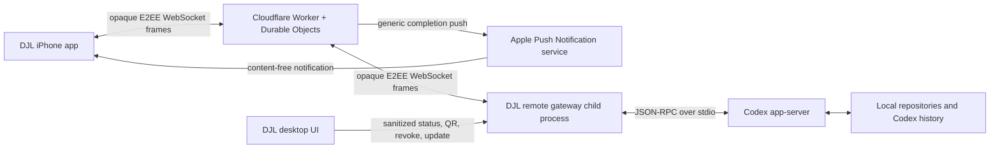
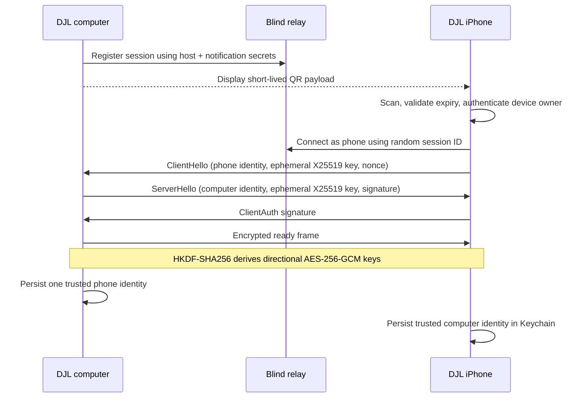

# DJL Remote Architecture

## Product contract

DJL Remote gives the paired iPhone the same Codex-control surface provided by the imported Remodex application: task listing and history, prompts and queueing, approvals, images and voice, project and workspace browsing, terminal actions, diffs, checkpoints, Git operations, runtime settings, and generic completion notifications.

The intended setup is install, scan, approve, and work:

1. A production DJL desktop release starts the local remote gateway automatically.
2. **Settings → Remote** shows a five-minute QR code and a ten-character fallback code.
3. The iPhone scans the QR and approves access with the device-owner authentication policy.
4. Both devices remember each other's long-term public identity. Later sessions reconnect without another scan until the user revokes the pairing.

Only one phone identity is trusted by a computer at a time. Pairing another phone replaces the previous phone.

## Components

- `apps/ios`: SwiftUI iPhone application, QR scanner, Keychain identity, encrypted transport, task UI, app lock, and APNs registration.
- `apps/desktop`: Electron lifecycle owner. It starts and supervises an isolated Node-mode gateway child and exposes only sanitized pairing/status data to the renderer.
- `apps/remote-gateway`: local Codex bridge. It owns the computer identity, launches `codex app-server`, enforces the trusted-phone policy, encrypts traffic, and exposes the imported remote capability surface.
- `apps/remote-relay`: Cloudflare Worker and two Durable Objects. It forwards opaque WebSocket frames, resolves signed trusted reconnects, and sends generic APNs notifications.
- `packages/remote-protocol`: versioned schemas, canonical signed transcripts, session-resolution messages, nonce construction, and protocol constants shared by TypeScript services.

Compatibility identifiers such as the `@synara/*` package scope remain internal. DJL is the only product name.

## Pairing and key agreement

The QR contains the relay URL, a random session identifier, the computer device identifier and Ed25519 public identity, the expiry, protocol version, and display name. It does not contain the computer private key, relay host secret, notification secret, or an application traffic key.

The handshake uses persistent Ed25519 identities and ephemeral X25519 keys. A canonical, length-prefixed, domain-separated transcript binds the protocol version, mode, session, key epoch, both device IDs, both identity keys, both ephemeral keys, nonces, and expiry. Direction-specific AES-256-GCM keys are derived with HKDF-SHA256. Nonces encode the sender direction and a monotonic counter; replayed or out-of-order counters are rejected.

The iPhone stores its private identity and trusted-computer registry with `kSecAttrAccessibleWhenUnlockedThisDeviceOnly`. The computer stores gateway state in a user-only file and mirrors supported secret material in the operating-system credential store. Neither private identity is sent to the relay.

## Trusted reconnect

When the QR session expires or DJL restarts, the computer registers a fresh random relay session. The iPhone asks the registry to resolve that session using a signed request containing its identity, the trusted computer identity, a timestamp, and a random nonce. The relay verifies the Ed25519 signature, rejects timestamps outside the 90-second window, and rejects reused nonces. The two endpoints then perform a fresh ephemeral handshake in `trusted_reconnect` mode.

The registry response never grants trust by itself. The gateway still verifies the phone identity against its single local trust record and the phone verifies the computer identity against its Keychain record. An identity mismatch requires re-pairing.

## Relay privacy boundary

The relay can observe:

- relay session and device identifiers, public identity keys, computer display name, and pairing expiry;
- online/offline timestamps, IP/network metadata available to Cloudflare, encrypted frame sizes, timing, and rate-limit events;
- APNs device token, push environment, thread/turn routing identifiers, and completion/failure state.

The relay cannot decrypt prompts, responses, transcript history, approvals, file contents, image or voice data, terminal data, Git data, or application traffic keys. It does not queue transcript frames. APNs payloads contain only “DJL task finished,” an instruction to open DJL, routing IDs, and result state.

## Lifecycle, failure, and revocation

- Electron starts the gateway after app readiness, restarts an unexpected exit with bounded backoff, and terminates it during desktop shutdown.
- A newer socket for the same role replaces the older socket. A session permits one computer and one phone connection.
- Frames are capped at 1 MiB and each connection has a bounded message rate. Oversized, malformed, stale, or replayed input is rejected.
- The iPhone shows a reconnecting state during transient network loss. Identity mismatch, revocation, or unsupported protocol versions become explicit re-pair/update states.
- **Reset trusted phone** removes the computer's local trust and rotates the pairing session. The relay administrator endpoint can revoke a session, immediately closing both sockets.
- Disabling Remote in desktop settings stops the child process and removes the active access path without deleting local task data.

## Current ownership boundary

The remote gateway launches its own Codex app-server and shares the user's Codex history on disk; it does not reuse DJL desktop's in-memory provider session. This matches the Remodex capability model and lets the phone list, resume, and control the same persisted Codex tasks. Until a future single-owner broker unifies both runtimes, avoid actively driving the same task from desktop and iPhone at the same instant. A reconnect reconciles through persisted Codex history, but simultaneous input can still produce conflicting turns.

## Release invariants

- Production desktop artifacts must embed a credential-free `wss://` relay URL ending in `/relay`.
- Staging and production use different Worker names, Durable Object storage, APNs credentials, and administrator tokens.
- QR payloads expire after five minutes and are never logged as full JSON.
- Notification text stays generic; adding prompt or response previews requires a new security review.
- Changing transcript fields, nonce rules, or cryptographic algorithms requires a protocol-version bump and cross-platform vectors.
